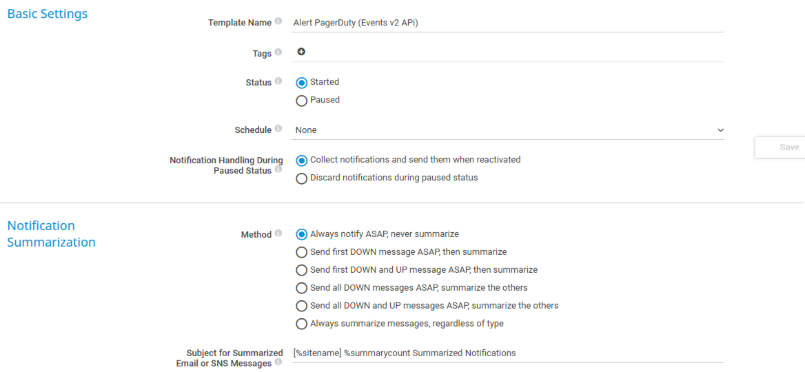
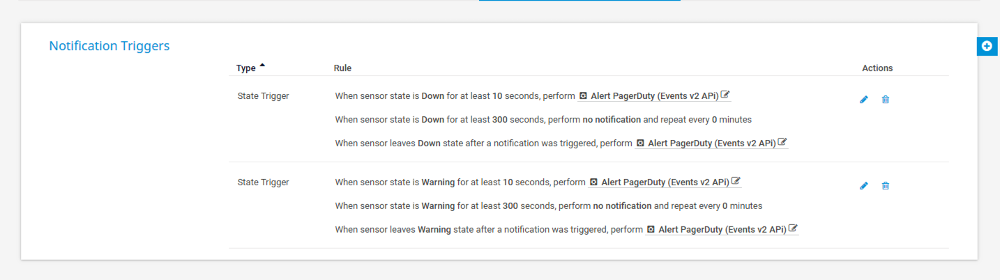
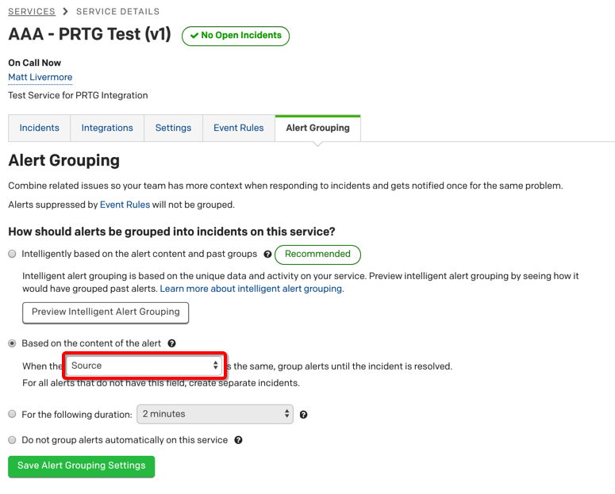
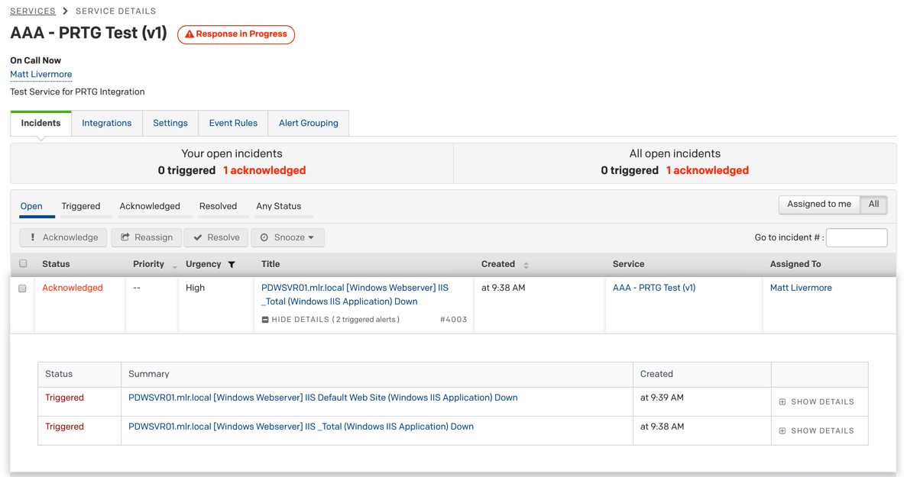

# prtg2pd

This is a PowerShell script that can be used with PRTG Network Monitor to send a JSON-formatted alert payload to a PagerDuty Events v2 API endpoint managed by an event ruleset.

## Test Environment
This PowerShell script has been tested with the following configuration:
* Windows Server 2016 Standard
* PowerShell v5.x or higher
* PRTG v19.2

## Installation

Copy the PowerShell script to the following directory on the PRTG server:

`C:\Program Files (x86)\PRTG Network Monitor\Notifications\EXE`

The script is designed to send events to PagerDuty that will both trigger and resolve an incident.  Modify the script adding the appropriate PagerDuty integration key.  To minimize the number of scripts that need to be maintained, consider using a key associated with an event ruleset endpoint.

The script is called via a new Notification Template (see Setup | Account Settings | Notification Templates).

Then select the 'Execute Program' method and select the corresponding PowerShell script for creating and resolving PagerDuty incidents.

Specify the parameters PRTG should send to the PowerShell script.  The script expects the following parameters in the exact order:

`'%probe' '%device' '%deviceid' '%sensor' '%sensorid' '%group' '%groupid' '%home' '%host' '%status' '%colorofstate' '%down' '%priority' '%message' '%comments' '%datetime'`

Then create a Notification Trigger.  This can be done in one of two ways:

1. Create a new Library and drag the desired devices into the Library and then create the Notification Trigger at this level.
1. Create the Notification Trigger at the Root level.

## Futher Optimisations Within PagerDuty

To reduce the number of incidents created by PagerDuty [alert grouping](https://support.pagerduty.com/docs/event-intelligence) should be enabled on your services.

This will then group all the alerts for a given node into a single incident.

